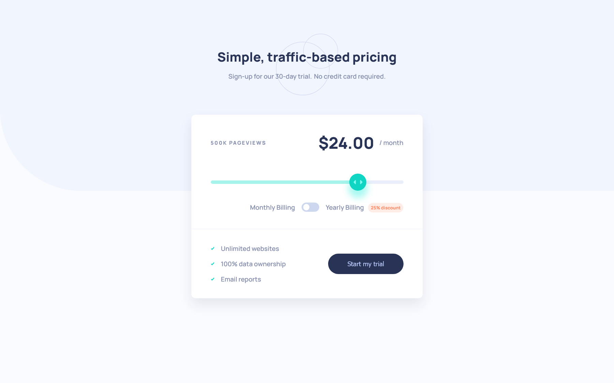
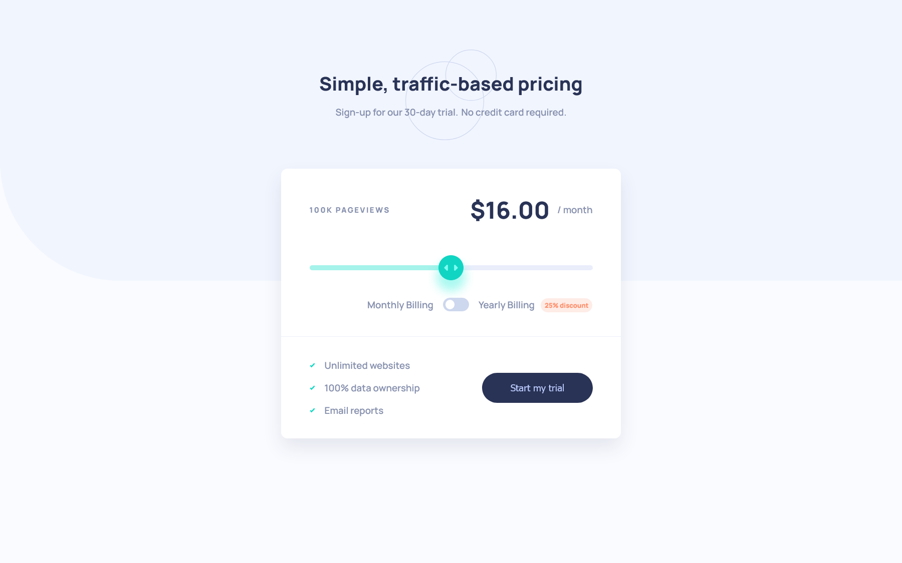

# Frontend Mentor - Interactive pricing component solution

This is a solution to the [Interactive pricing component challenge on Frontend Mentor](https://www.frontendmentor.io/challenges/interactive-pricing-component-t0m8PIyY8). Frontend Mentor challenges help you improve your coding skills by building realistic projects. 

## Table of contents

- [Overview](#overview)
  - [The challenge](#the-challenge)
  - [Screenshot](#screenshot)
- [My process](#my-process)
  - [Built with](#built-with)
  - [What I learned](#what-i-learned)
- [Author](#author)

## Overview

### The challenge

Users should be able to:

- View the optimal layout for the app depending on their device's screen size
- See hover states for all interactive elements on the page
- Use the slider and toggle to see prices for different page view numbers

### Screenshot

## My process

### Built with

- Semantic HTML5 markup
- CSS custom properties
- Flexbox
- CSS Grid
- Mobile-first workflow
- [React](https://reactjs.org/) - JS library
- [Sass](https://sass-lang.com/) - CSS extension language

### What I learned
- Customized the range type of input elements.
- Dynamically rendered the number of elements at different progress or range when changing the input value.
- Ensured a responsive layout for different browsers.

## Author

- Website - [Ruo-Fang Wang](https://wang0857.github.io/myWebPortfolios/)
- Frontend Mentor - [Ruo-Fang Wang](https://www.frontendmentor.io/profile/wang0857)
- LinkedIn - [Ruo-Fang Wang](https://ca.linkedin.com/in/ruo-fang-wang-550269226)
